# GitHub Profile Themes

为 Theater-ahyeon 制作的 **7 套 GitHub 主页主题**，每套都有深浅版本、完整 README 和真实开源协作数据。

[使用与维护](USAGE.md) · [素材来源](SOURCES.md) · [数据快照](data/github.json) · [自动更新](https://github.com/Theater-ahyeon/github-profile-themes/actions)

当前个人主页仍使用 Q 版菲比手账。本合集包含本次会话的三套菲比主题，以及四套 DeepSeek 梗图主题。

## 主题速览

| 主题 | 视觉方向 | 完整模板 | 完整预览 |
|---|---|---|---|
| **辉弦圣堂** | 白金圣光、蓝色彩窗与古典衬线字体。 | [README](themes/phoebe-cathedral/README.md) | [浅色](previews/phoebe-cathedral-light.png) · [深色](previews/phoebe-cathedral-dark.png) |
| **菲比贴纸手账** | 奶油方格纸、Q 版菲比、蓝紫便签和圆角纸卡。 | [README](themes/phoebe-notebook/README.md) | [浅色](previews/phoebe-notebook-light.png) · [深色](previews/phoebe-notebook-dark.png) |
| **海风暮光** | 海边暮光、留白排版与克制的香槟色细线。 | [README](themes/phoebe-sea-glow/README.md) | [浅色](previews/phoebe-sea-glow-light.png) · [深色](previews/phoebe-sea-glow-dark.png) |
| **奶茶休息站** | 焦糖与奶油色、咖啡馆菜单、奶茶补给和票据装饰。 | [README](themes/deepseek-cafe/README.md) | [浅色](previews/deepseek-cafe-light.png) · [深色](previews/deepseek-cafe-dark.png) |
| **终端工作台** | 薄荷绿命令行、等宽字体与正在思考的蓝鲸助手。 | [README](themes/deepseek-terminal/README.md) | [浅色](previews/deepseek-terminal-light.png) · [深色](previews/deepseek-terminal-dark.png) |
| **开发者小报** | 报纸栏线、超长上下文梗图、刊号与编辑部式排版。 | [README](themes/deepseek-press/README.md) | [浅色](previews/deepseek-press-light.png) · [深色](previews/deepseek-press-dark.png) |
| **鲸鱼太空舱** | 轨道弧线、发射面板、火箭鲸鱼与蓝橙对比。 | [README](themes/deepseek-orbit/README.md) | [浅色](previews/deepseek-orbit-light.png) · [深色](previews/deepseek-orbit-dark.png) |

## 图库

### 辉弦圣堂 / Radiant Cathedral

白金圣光、蓝色彩窗与古典衬线字体。

[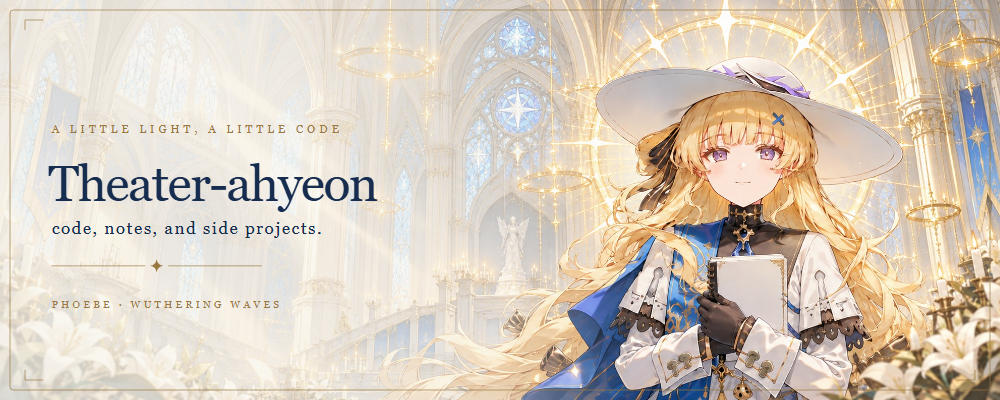](themes/phoebe-cathedral/README.md)

查看深色横幅

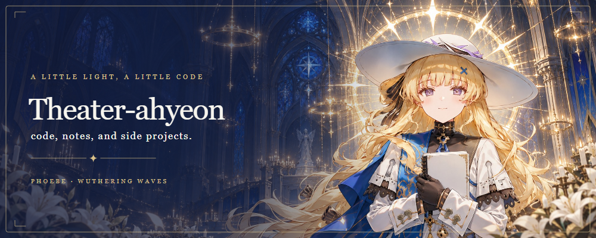

### 菲比贴纸手账 / Phoebe Notebook

奶油方格纸、Q 版菲比、蓝紫便签和圆角纸卡。

[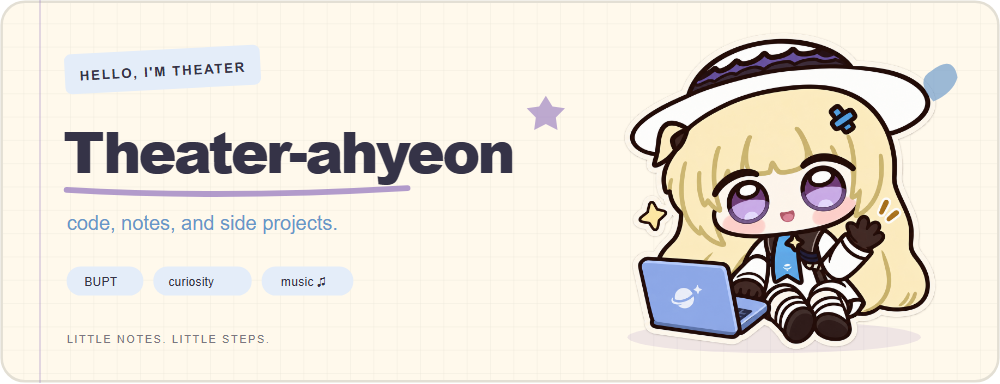](themes/phoebe-notebook/README.md)

查看深色横幅

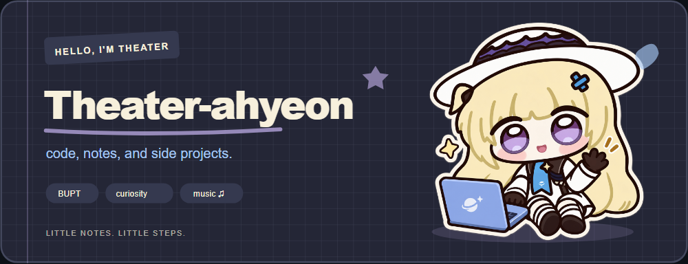

### 海风暮光 / Sea Glow

海边暮光、留白排版与克制的香槟色细线。

[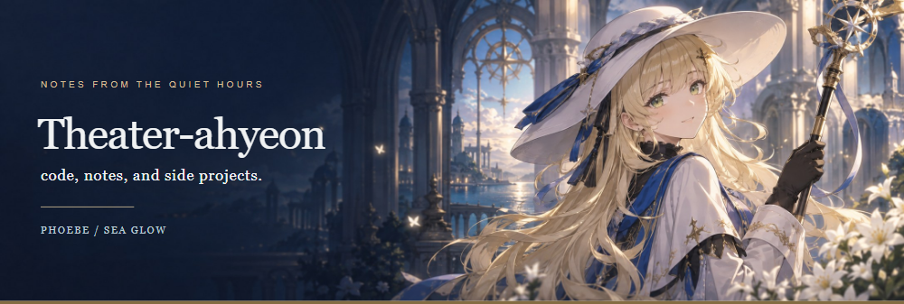](themes/phoebe-sea-glow/README.md)

查看深色横幅

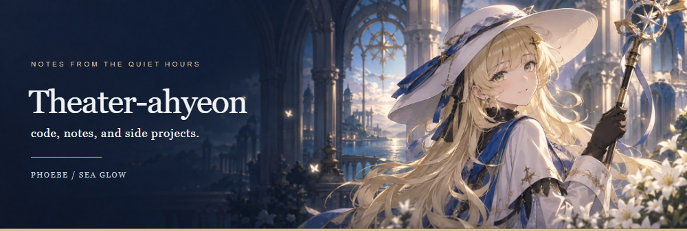

### 奶茶休息站 / Token Tea Club

焦糖与奶油色、咖啡馆菜单、奶茶补给和票据装饰。

[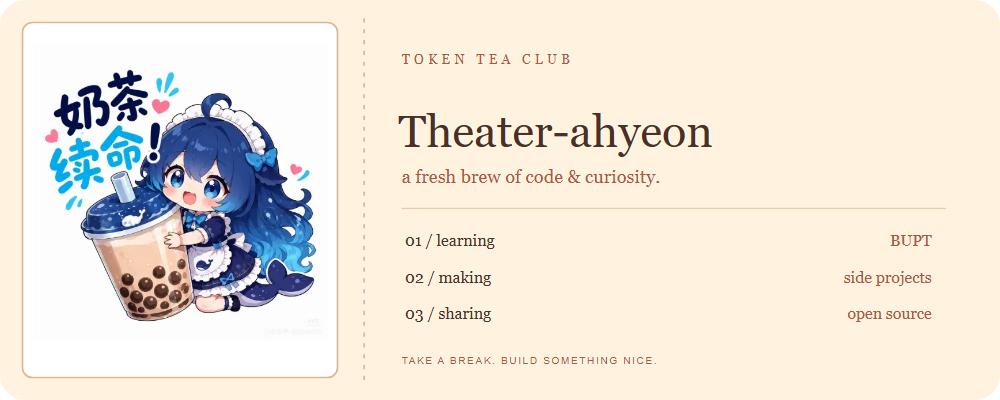](themes/deepseek-cafe/README.md)

查看深色横幅

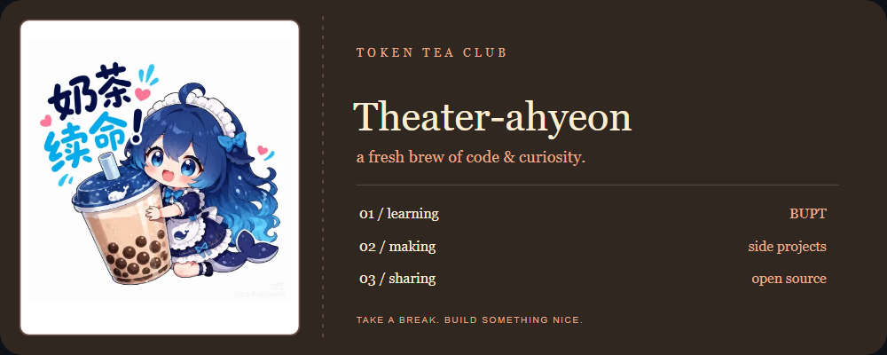

### 终端工作台 / Whale Terminal

薄荷绿命令行、等宽字体与正在思考的蓝鲸助手。

[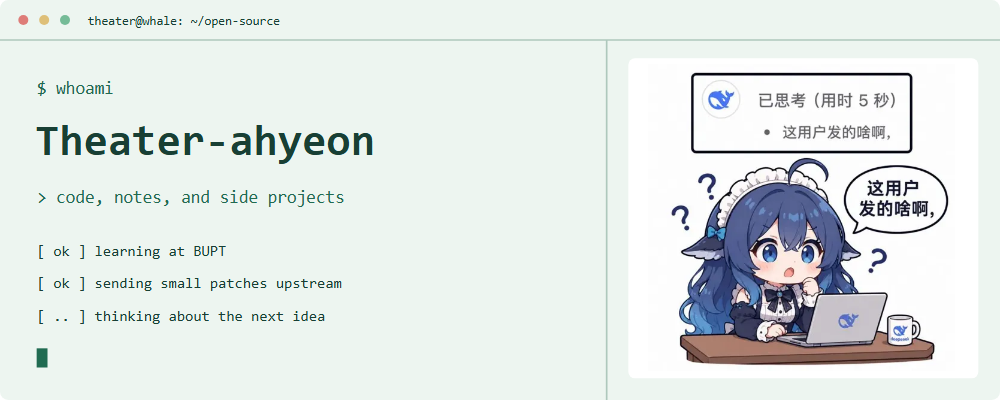](themes/deepseek-terminal/README.md)

查看深色横幅

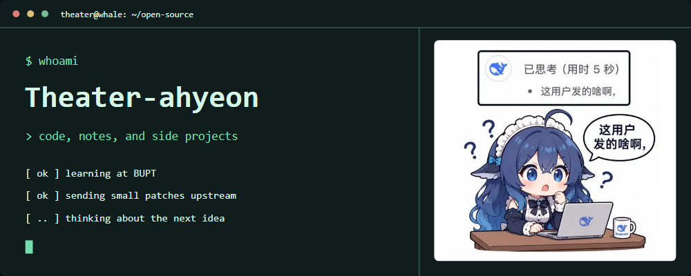

### 开发者小报 / The Context Times

报纸栏线、超长上下文梗图、刊号与编辑部式排版。

[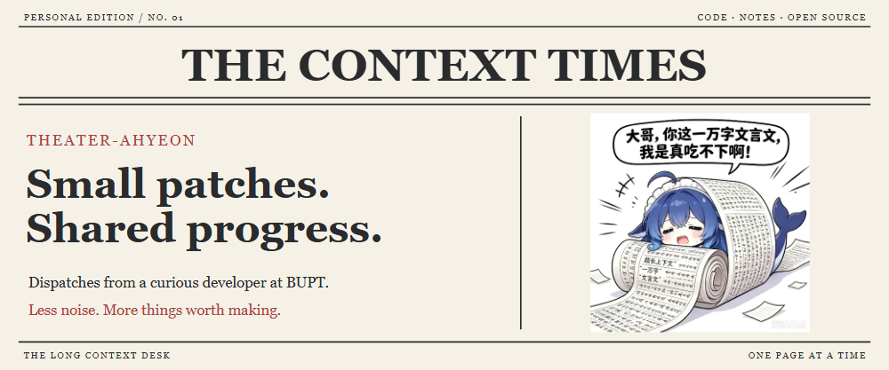](themes/deepseek-press/README.md)

查看深色横幅

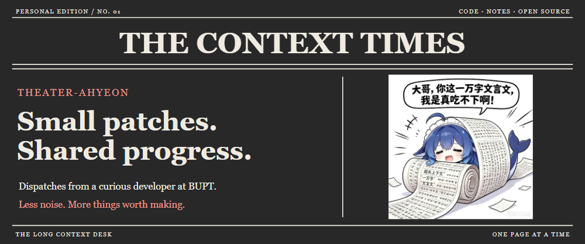

### 鲸鱼太空舱 / Whale Orbit

轨道弧线、发射面板、火箭鲸鱼与蓝橙对比。

[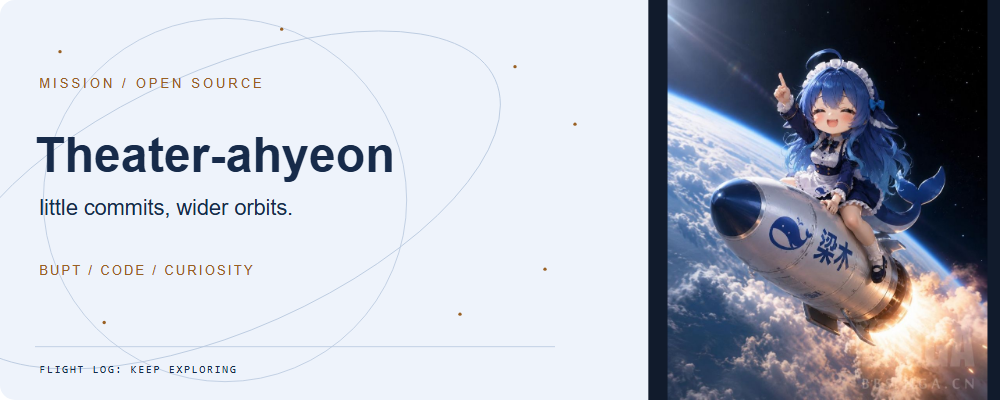](themes/deepseek-orbit/README.md)

查看深色横幅

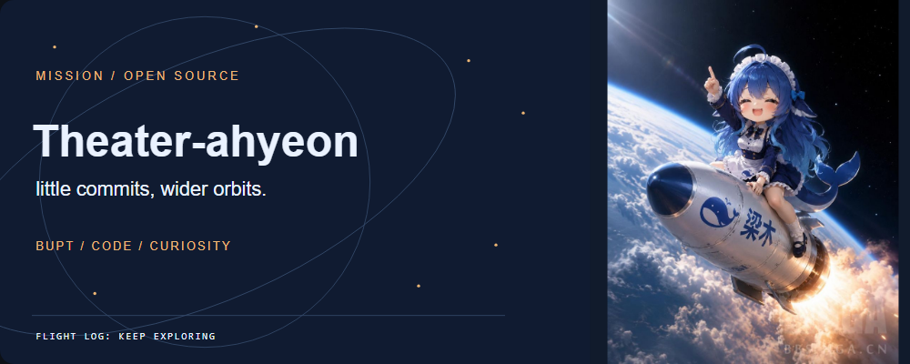

## 使用

打开任意主题的 README，复制 Raw 源文到个人主页仓库的 `README.md` 即可；图片使用本合集的绝对地址。详细步骤见 [USAGE.md](USAGE.md)。不会自动覆盖现有主页。

## 开源协作数据

每套主题均展示已合并 PR 总数、上游项目数量、逐项目合并记录与代表 PR 链接。每日从 GitHub 分页获取更新；排除本人仓库、私有仓库与 fork 仓库，并验证 `mergedAt`。不把未合并提交计入已合并贡献。

## 验证

- 84 张 SVG 可解析且不依赖外部嵌套资源。
- 14 组深浅桌面预览。
- 14 组 390px 移动宽度的图片加载、溢出检查，记录见 [previews/checks.json](previews/checks.json)。
- 预览 PNG 是设计截图，实时数据以主题 README 的 SVG 与 `data/github.json` 为准。

素材图片保留已有署名和水印，图片不适用代码 MIT 许可。详情见 [SOURCES.md](SOURCES.md)。
